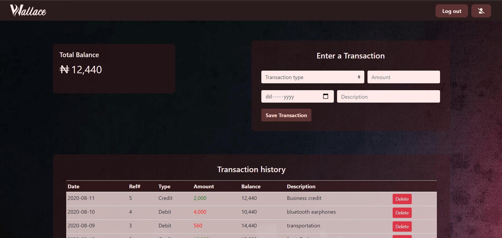
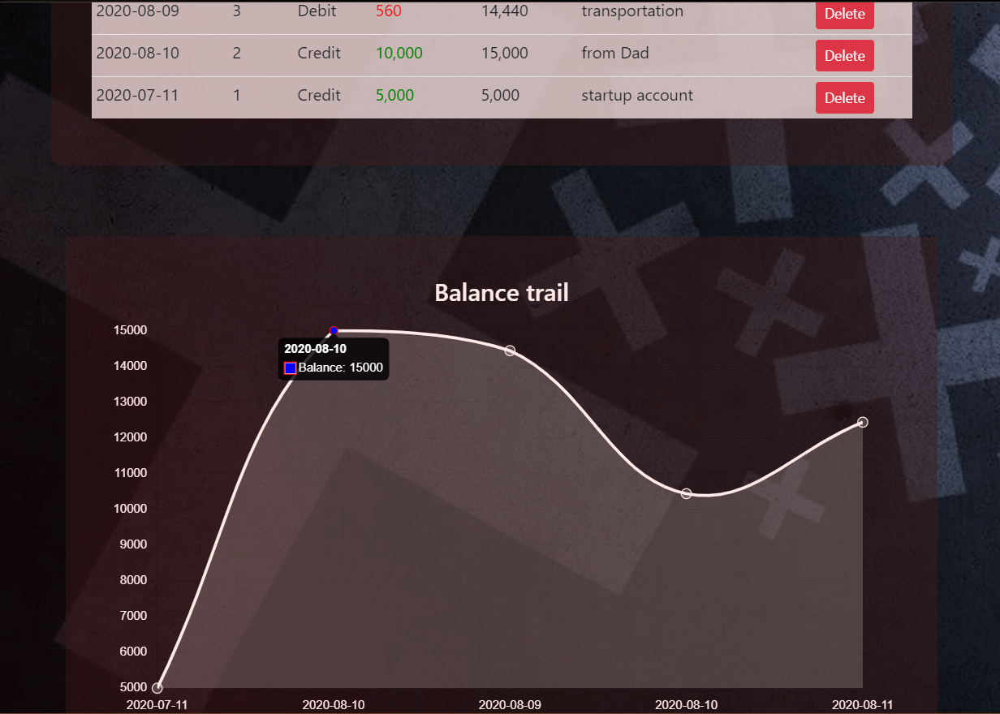

# Wallace
Balance tracking for your wallet.

Wallace provides a way to make more informed financial decisions, by tracking your balance, through your income & expenditure. The balance from each account is visualized on a chart to help the user see their spending and earning history.

## Built With

- Javscript, webpack 
- Sass.

## Live Demo

[Live Demo Link](https://wallacev2.netlify.app/)

## Getting Started

To get a local copy up and running follow these simple example steps.

### Prerequisites
You will need to have `node` installed in other to use `npm` which will be needed to install the dependencies needed.

### Setup
`Clone the project and cd into the directory`

### Install
run `npm install` to install all the dependencies of the project

### Usage
run  `npm run server` to get the project running locally

## Authors

👤 **Author**

- Github: [@bellogo](https://github.com/bellogo)
- Linkedin: [Ufuoma Ogodo](https://ng.linkedin.com/in/ufuoma-ogodo)

## 🤝 Contributing

Contributions, issues and feature requests are welcome!

## Show your support

Give a ⭐️ if you like this project!

